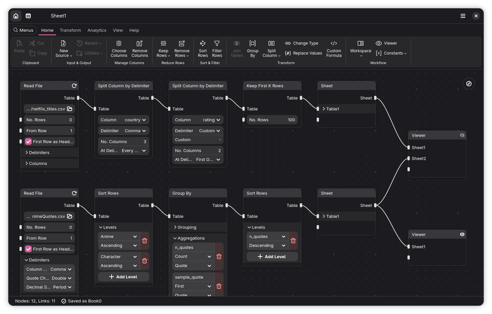
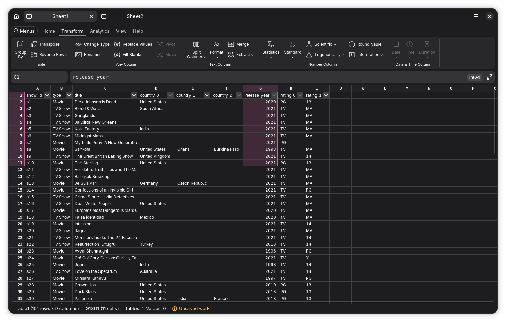

# Witt Data Studio

**Witt Data Studio** is a powerful, user-friendly, and integrated data platform.

The word "witt", we believe, is the past form of "wit" which means "understanding, intellect, sense; knowledge, consciousness, conscience". The word "data" is an important addition to further differentiate it from *Wit Studio*, the Japanese animation studio best known for producing *Attack on Titan*.

**Disclaimer:** We know this project sounds ambitious! We're actively exploring the best path forward, balancing community needs with what's technically achievable. Our direction and approaches may evolve as we learn and build.





**Note:** All screenshots above do not represent the final product.

## Status

Currently in early development. Please don't expect anything to work at this stage. Follow our repository for real-time updates and get ready to transform your data workflow!

## Use Cases

[TODO]

## Tutorial

[TODO]

## Background

[TODO]

## Roadmap

[TODO]

## Build & Run

The recommended way to build and run this project is using [GNOME Builder](https://apps.gnome.org/Builder/). Select the default manifest file (`com.macipra.witt.json`) and click the `Run` button.

## Development

[TODO]

### GNU/Linux

I personally use [Visual Studio Code](https://code.visualstudio.com/), but you can use whatever your favorite is. To run and build using Flatpak on VS Code, consider installing [Flatpak](https://marketplace.visualstudio.com/items?itemName=bilelmoussaoui.flatpak-vscode) extension.

Execute the following commands in the terminal to install the dependencies (on Fedora):

```sh
sudo dnf install flatpak flatpak-builder --assumeyes
```

Select the `com.macipra.witt.Devel.json` manifest file by typing in the command palette (<kbd>F1</kbd> or <kbd>Ctrl</kbd>+<kbd>Shift</kbd>+<kbd>P</kbd>) and running `Flatpak: Select or Change Active Manifest`.

Create the `run.sh` file in the `build-aux/` directory:

```sh
cp build-aux/run.sh.example build-aux/run.sh
```

To build the plugins, we need the `rustup` and `maturin` installed:

```sh
sudo dnf install rustup --assumeyes
rustup-init
. "$HOME/.cargo/env"
pip install maturin
```

Building all plugins is simply a matter of running the following command:

```sh
chmod +x build-aux/build.sh
./build-aux/build.sh
```

Finally, type in the command palette and run `Flatpak: Build and Run` or simply hit <kbd>Ctrl</kbd>+<kbd>Alt</kbd>+<kbd>B</kbd>.

To override some environment variables or to add command-line arguments to the application, you can update the `build-aux/run.sh` file, for example:

```txt
#!/bin/bash
__NV_PRIME_RENDER_OFFLOAD=1 __GLX_VENDOR_LIBRARY_NAME=nvidia GTK_DEBUG= WDS_DEBUG= POLARS_VERBOSE= /app/bin/witt-data-studio "$@"
```

With `debugpy` in Visual Studio Code, you'll need to setup `.vscode/launch.json` for example:

```json
{
    "configurations": [
        {
            "name": "Python Debugger: Remote Attach",
            "type": "debugpy",
            "request": "attach",
            "connect": {
                "host": "localhost",
                "port": 5678
            },
            "pathMappings": [
                {
                    "localRoot": "${workspaceFolder}/src",
                    "remoteRoot": "/app/share/witt-data-studio/witt_data_studio"
                }
            ]
        }
    ]
}
```

Set the environment variable to `WDS_DEBUG=2` to wait for the debugger after running the application. Press <kbd>F5</kbd> to launch it and you're ready to debug.

If you're using a Python language server, you may want to install the requirements. For better dependency management, it's recommended to create a virtual environment rather than installing packages globally:

```sh
python -m venv .pyenv
source .pyenv/bin/activate
pip install -r build-aux/requirements-devel.txt
```

To add new dependencies using [`pip`](https://packaging.python.org/en/latest/key_projects/#pip) to the [`flatpak-builder`](https://docs.flatpak.org/en/latest/flatpak-builder.html) manifest json file, you can use the [`flatpak-pip-generator`](https://github.com/flatpak/flatpak-builder-tools/tree/master/pip). Either adding the reference to the `com.macipra.witt*.json` files or copy-pasting the content directly into the manifest files and delete the generated file. Do not forget to update the `requirements*.txt` files as well.

When it comes to the plugin development, usually I do this following example steps:

1. Activate the virtual environment: `source .pyenv/bin/activate`
1. Go to the plugin directory: `cd plugins/polars/witt-strutil`
1. Check if there's any dependency issues: `cargo check`
1. Install the plugin in the current virtual environment: `maturin develop`
1. Write/update some tests in `test/` directory
1. Run the tests, make sure they all pass: `pytest -vv -s`
1. Build the plugin as a wheel (.whl) file: `maturin build --release`
1. Copy the wheel file to the `dist` directory: `cp target/wheels/*.whl ../../../dist/`
1. Type in the command palette and run: `Run Flatpak: Update Dependencies`
1. Type in the command palette and run: `Run Flatpak: Build and Run` (or <kbd>Ctrl</kbd>+<kbd>Alt</kbd>+<kbd>B</kbd>)
1. Update the related files if necessary. For example, if we want to bump the version up, we need to update `Cargo.toml` and the related files in the `build-aux/` directory. We need to publish it to the [PyPI](https://pypi.org/) if it's a Python package.

## Licenses

This project is distributed under the [GNU Affero General Public License Version 3](LICENSE) (AGPL-3). We use [GTK](https://www.gtk.org/) and [Libadwaita](https://gitlab.gnome.org/GNOME/libadwaita) to build the user interface, which are licensed under the [GNU Lesser General Public License Version 2.1](https://www.gnu.org/licenses/lgpl-2.1.en.html) (LGPL-2.1). The backend for data manipulation uses [Polars](https://pola.rs/), which is distributed under the [MIT License](https://opensource.org/license/mit). For other dependencies, see the `build-aux/requirements.txt` file. We use icons from [Carbon Design System](https://carbondesignsystem.com/elements/icons/library/), which is distributed under the [Creative Commons Attribution 4.0 International License](https://creativecommons.org/licenses/by/4.0/).

## Alternatives

If **Witt Data Studio** doesn't fit your need, I personally would recommend you to try one of these alternatives:

- KNIME Analytics Platform (Free)
- Orange Data Mining (Free)
- Altair RapidMiner (Freemium)
- Alteryx Designer (Paid)

Or more generic BI products:

- Apache Superset (Free)
- Microsoft Power BI (Freemium)
- Tableau (Paid)

Or more specialized solutions:

- Jupyter Lab (Free)
- Positron (Free)
- OriginPro (Paid)

**Disclaimer:** We're not affiliated or sponsored by any of the companies that developed the above products. We simply want to help you find the one that best suits your workflow.