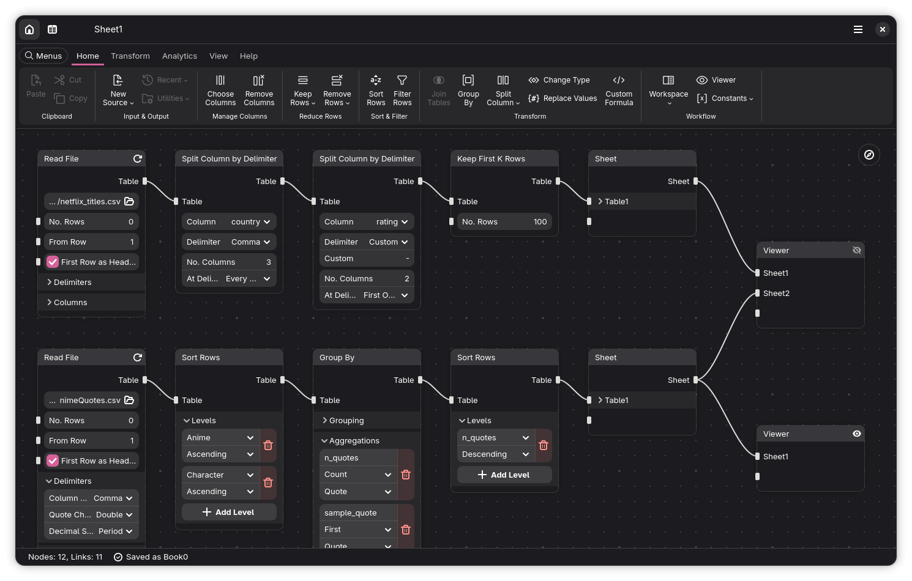
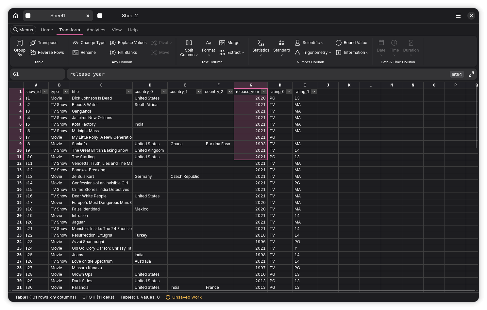

# Witt Data Studio

**Witt Data Studio** is a powerful, user-friendly, and integrated data platform.

The word "witt", we believe, is the past form of "wit" which means "understanding, intellect, sense; knowledge, consciousness, conscience". The word "data" is an important addition to further differentiate it from *Wit Studio*, the Japanese animation studio best known for producing *Attack on Titan*.

**Disclaimer:** We know this project sounds ambitious! We're actively exploring the best path forward, balancing community needs with what's technically achievable. Our direction and approaches may evolve as we learn and build.

**Note:** All screenshots above do not represent the final product.

## Status

Currently in early development.

## Documentation

Please visit [our official wiki](https://github.com/naruaika/witt-data-studio/wiki).

## Contributing

We're currently accepting all but external code contributions.

## Licenses

This project, excluding files related to brand identity, is distributed under the [Apache License Version 2](LICENSE).

We use [GTK](https://www.gtk.org/) and [Libadwaita](https://gitlab.gnome.org/GNOME/libadwaita) to build the user interface, which are licensed under the [GNU Lesser General Public License Version 2.1](https://www.gnu.org/licenses/lgpl-2.1.en.html) (LGPL-2.1). The backend for data manipulation uses [Polars](https://pola.rs/), which is distributed under the [MIT License](https://opensource.org/license/mit). For other dependencies, see the `build-aux/requirements.txt` file. We use icons from [Carbon Design System](https://carbondesignsystem.com/elements/icons/library/), which is distributed under the [Creative Commons Attribution 4.0 International License](https://creativecommons.org/licenses/by/4.0/).

## Alternatives

If **Witt Data Studio** doesn't fit your need, I personally would recommend you to try one of these alternatives:

- KNIME Analytics Platform (Free)
- Orange Data Mining (Free)
- Altair RapidMiner (Freemium)
- Alteryx Designer (Paid)

Or more generic BI products:

- Apache Superset (Free)
- Microsoft Power BI (Freemium)
- Tableau (Paid)

Or more specialized solutions:

- Jupyter Lab (Free)
- Positron (Free)
- OriginPro (Paid)

**Disclaimer:** We're not affiliated or sponsored by any of the companies that developed the above products. We simply want to help you find the one that best suits your workflow.
